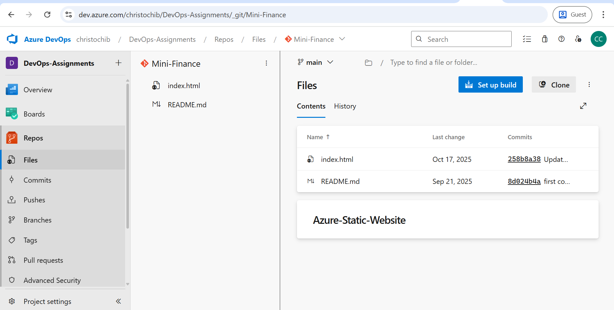
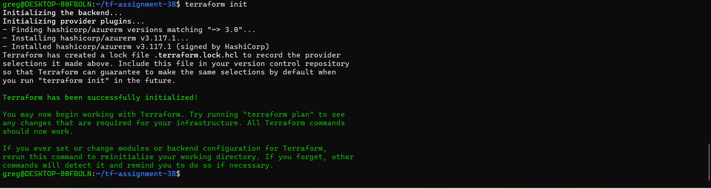
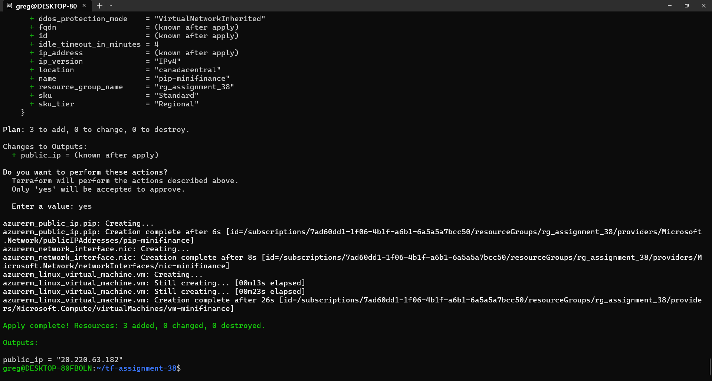
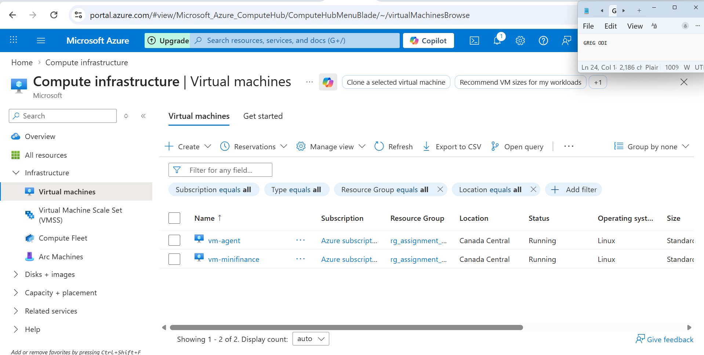
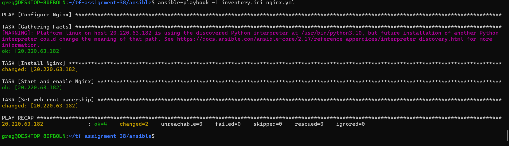
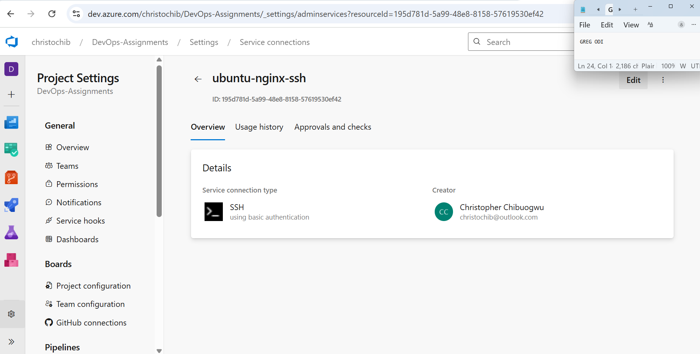
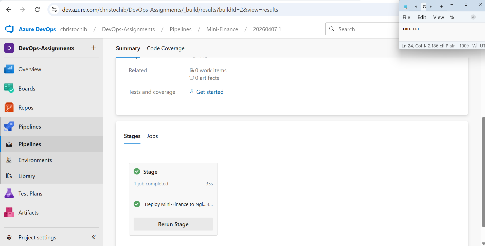
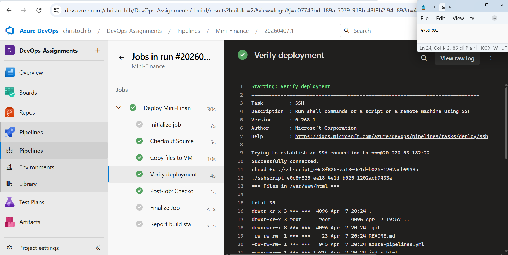
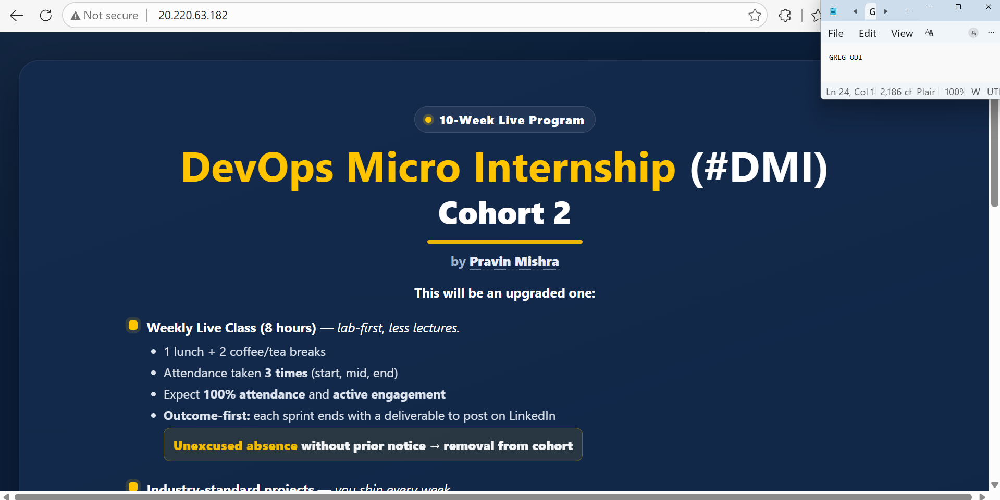

# Assignment 38 — Mini-Finance Static Website CI/CD

## What Was Built

A complete CI/CD pipeline that automatically deploys a static website to an Ubuntu VM running Nginx every time code is pushed to the `main` branch.

## Architecture
## Tech Stack

| Tool | Purpose |
|------|---------|
| Terraform | Provision Azure VM, VNet, NSG, Public IP |
| Ansible | Install and configure Nginx on the VM |
| Azure DevOps Pipelines | CI/CD automation |
| CopyFilesOverSSH | Deploy website files to VM |
| Nginx | Serve static website on port 80 |

## Folder Structure
> **Note:** The actual Terraform working directory is `~/tf-assignment-38/` in WSL.
> The `ansible/` folder is at `~/tf-assignment-38/ansible/`.

## Prerequisites

- Assignment 37 complete (SelfHostedPool agent running as vm-agent)
- Azure CLI logged in: `az login`
- SSH key pair: `~/.ssh/azureagent-key`
- Azure DevOps project: DevOps-Assignments

## Step 1 — Import the Repository

> ⚠️ Import repository button disappears on repos with a README. Use git remote push instead.
```bash
cd ~
git clone https://github.com/pravinmishraaws/Azure-Static-Website.git Mini-Finance
cd Mini-Finance
git remote add azuredevops https://christochib@dev.azure.com/christochib/DevOps-Assignments/_git/Mini-Finance
git push azuredevops main --force
```



## Step 2 — Provision VM with Terraform
```bash
mkdir -p ~/tf-assignment-38
cd ~/tf-assignment-38
# Create main.tf — see terraform/main.tf
terraform init
terraform apply -var="ssh_public_key=$(cat ~/.ssh/azureagent-key.pub)"
```

> ⚠️ Use `sku = "Standard"` on Public IP — Basic SKU not available on free subscriptions.





## Step 3 — Configure Nginx with Ansible
```bash
cd ~/tf-assignment-38/ansible
ansible-playbook -i inventory.ini nginx.yml
# Expected: ok=4  changed=2  unreachable=0  failed=0
```




## Step 4 — Create SSH Service Connection

Azure DevOps → Project Settings → Service connections → New → SSH

| Field | Value |
|-------|-------|
| Host name | VM public IP |
| Port | 22 |
| Private Key | `cat ~/.ssh/azureagent-key` |
| Username | azureuser |
| Password | Leave blank |
| Name | ubuntu-nginx-ssh |



## Step 5 — Run the Pipeline

Pipeline YAML — see [pipeline/azure-pipelines.yml](pipeline/azure-pipelines.yml)

> If **Permission needed** appears — click View → Permit → Permit




## Step 6 — Verify the Website



## Cost Management
```bash
# After each session
az vm deallocate --resource-group rg_assignment_38 --name vm-minifinance

# Before next session
az vm start --resource-group rg_assignment_38 --name vm-minifinance
```

## Challenges & Solutions

| Challenge | Solution |
|-----------|---------|
| Import repo button missing | Use git remote add + force push |
| Basic SKU Public IP limit | Add `sku = "Standard"` to azurerm_public_ip |
| No Verify button on SSH connection | Verified by successful pipeline run |
| Pipeline shows Permission needed | Click View → Permit → Permit |
| inventory.ini contains sensitive IP | Added to .gitignore — use inventory.ini.template |
