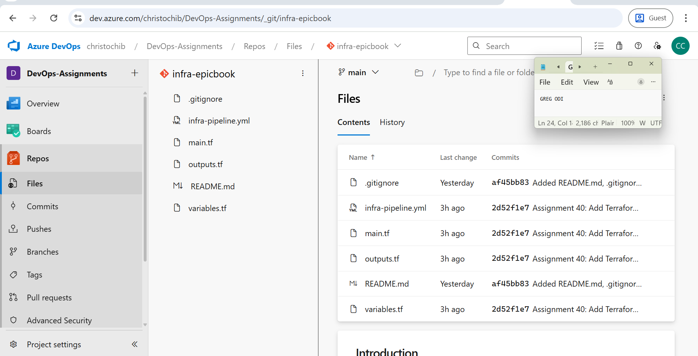
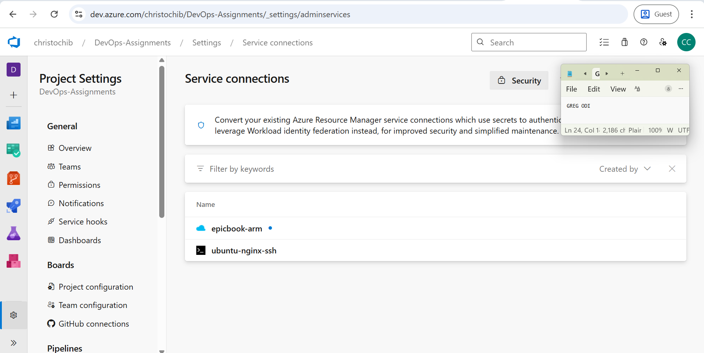
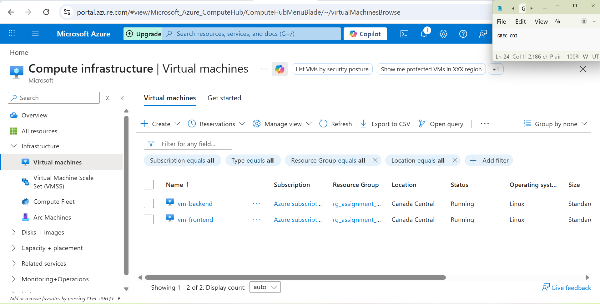
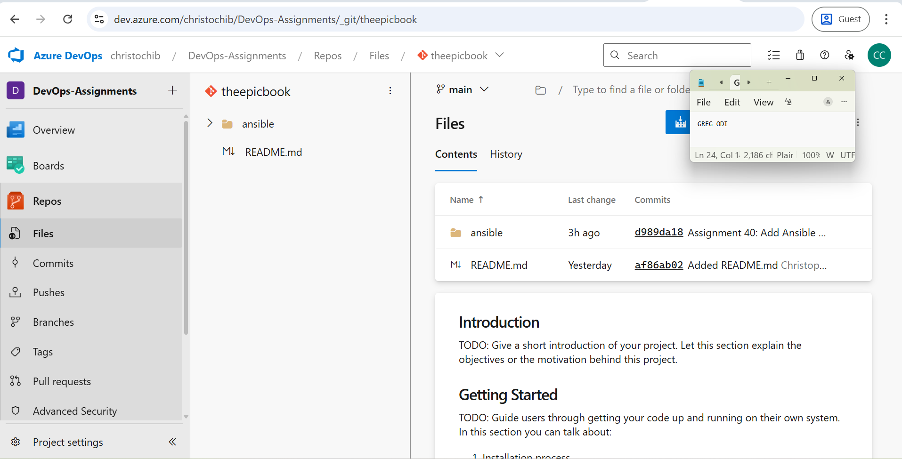
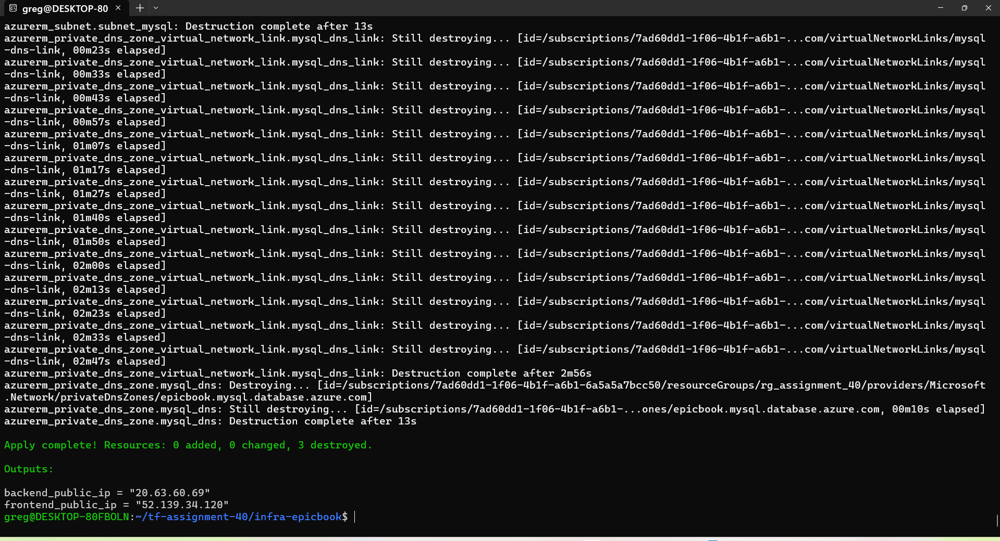
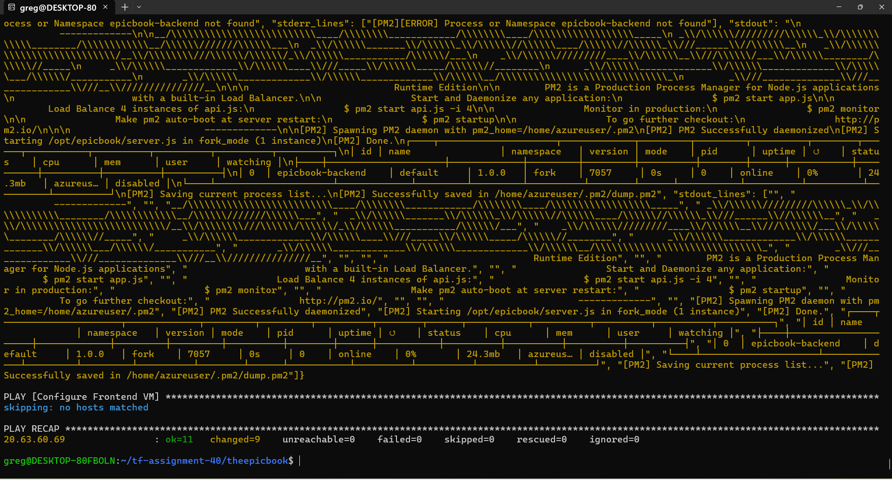
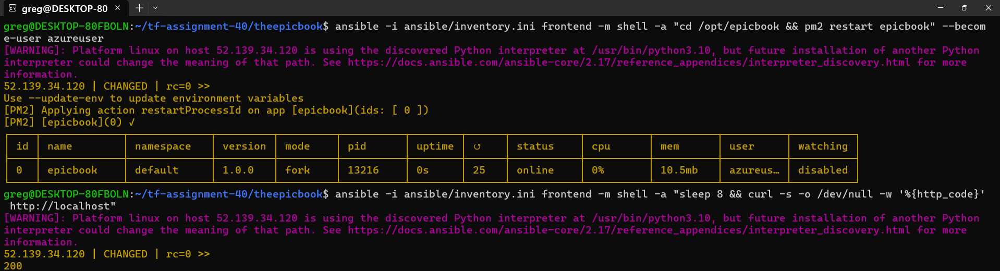
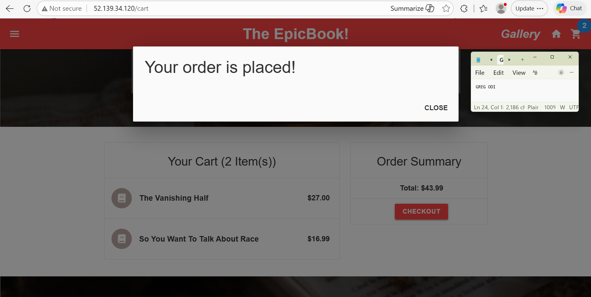

# Assignment 40 — EpicBook Enterprise CI/CD

**DevOps Micro Internship — Cohort 2**

A complete enterprise CI/CD deployment of the EpicBook bookstore application using a two-repository model (Infrastructure + Application), Azure DevOps pipelines, Terraform, Ansible, Node.js, and MySQL.

---

## Overview

| Item | Details |
|------|---------|
| **Infra Repo** | infra-epicbook (Terraform) |
| **App Repo** | theepicbook (Ansible + App) |
| **Frontend VM** | vm-frontend \| Standard_B2s_v2 \| Canada Central \| 52.139.34.120 |
| **Backend VM** | vm-backend \| Standard_B2als_v2 \| Canada Central \| 20.63.60.69 |
| **Database** | MySQL 8.0 on vm-backend |
| **Web Server** | Nginx (reverse proxy → Node.js port 8080) |
| **App** | EpicBook — Node.js + Express + Handlebars |
| **Live URL** | http://52.139.34.120 |
| **SPN** | epicbook-spn (Azure AD App Registration) |
| **Service Connection** | epicbook-arm (Azure Resource Manager) |

---

## Architecture

```
Browser → http://52.139.34.120
              |
         Nginx (port 80)          vm-frontend (52.139.34.120)
              |
         Node.js (port 8080)
              |
         MySQL (port 3306)        vm-backend (20.63.60.69)
```

---

## Step 1 — Create Azure AD App Registration (SPN)

```bash
az ad sp create-for-rbac --name "epicbook-spn" --role Contributor \
  --scopes /subscriptions/<your-subscription-id>
```

Save the output — `appId` (Client ID) and `password` (Client Secret). The secret is shown only once.

---

## Step 2 — Create Repositories in Azure DevOps

1. Go to **Azure DevOps → DevOps-Assignments → Repos**
2. Create **infra-epicbook** (with .gitignore: Terraform)
3. Create **theepicbook** (with README only)

### SS2 — infra-epicbook repo


---

## Step 3 — Clone and Add Terraform Files

```bash
cd ~/tf-assignment-40
git clone https://christochib@dev.azure.com/christochib/DevOps-Assignments/_git/infra-epicbook
cd infra-epicbook
```

Create `main.tf`, `variables.tf`, `outputs.tf` and `infra-pipeline.yml` — see `terraform/` folder.

> **Note:** Use `sku = "Standard"` on Public IPs — Basic SKU not available. (Lesson #10)

> **QUOTA WARNING:** Delete vm-agent resource group before provisioning A40 VMs. Only 4 vCPU available in Canada Central.

```bash
git add .
git commit -m "Assignment 40: Add Terraform infra code and pipeline"
git push origin main
```

---

## Step 4 — Create Azure Service Connection (SPN)

1. **Project Settings → Service connections → New service connection**
2. Select **Azure Resource Manager**
3. Select **App registration or managed identity (manual)**
4. Select **Service principal key** under Credential
5. Fill in:
   - Subscription ID: `<your-subscription-id>`
   - Application (client) ID: `<your-client-id>`
   - Directory (tenant) ID: `<your-tenant-id>`
   - Client secret: *(saved SPN secret)*
   - Name: `epicbook-arm`
6. Check **Grant access permission to all pipelines**
7. Click **Verify and Save**

### SS8 — epicbook-arm service connection


---

## Step 5 — Run Terraform Locally

> **NOTE:** Microsoft-hosted agents require paid parallelism. Terraform was run locally from WSL.

```bash
cd ~/tf-assignment-40/infra-epicbook

export ARM_CLIENT_ID="<your-client-id>"
export ARM_CLIENT_SECRET="YOUR_CLIENT_SECRET"
export ARM_TENANT_ID="<your-tenant-id>"
export ARM_SUBSCRIPTION_ID="<your-subscription-id>"

terraform init
terraform plan \
  -var="client_secret=$ARM_CLIENT_SECRET" \
  -var="ssh_public_key=$(cat ~/.ssh/azureagent-key.pub)"

terraform apply -auto-approve \
  -var="client_secret=$ARM_CLIENT_SECRET" \
  -var="ssh_public_key=$(cat ~/.ssh/azureagent-key.pub)"
```

Outputs after apply:
```
frontend_public_ip = "52.139.34.120"
backend_public_ip  = "20.63.60.69"
```

### SS1 — Azure Portal showing both VMs running


### SS3 — Terraform apply output


---

## Step 6 — Clone theepicbook and Add Ansible Files

```bash
cd ~/tf-assignment-40
git clone https://christochib@dev.azure.com/christochib/DevOps-Assignments/_git/theepicbook
cd theepicbook
mkdir -p ansible
```

Create `ansible/inventory.ini`, `ansible/vars.yml`, `ansible/playbook.yml`, `ansible/app-pipeline.yml` — see `ansible/` folder.

Update inventory with actual IPs:
```bash
sed -i 's/FRONTEND_IP/52.139.34.120/' ansible/inventory.ini
sed -i 's/BACKEND_IP/20.63.60.69/' ansible/inventory.ini
sed -i 's/MYSQL_FQDN/20.63.60.69/' ansible/vars.yml
```

```bash
git add .
git commit -m "Assignment 40: Add Ansible playbooks and app pipeline"
git push origin main
```

---

## Step 7 — Run Ansible Playbooks

Copy SSH key:
```bash
cp ~/.ssh/azureagent-key /tmp/azureagent-key
chmod 600 /tmp/azureagent-key
```

Configure backend (MySQL):
```bash
ansible-playbook -i ansible/inventory.ini ansible/playbook.yml --limit backend -v
```

### SS4 — Ansible backend output ok=8 failed=0


Configure frontend (EpicBook app + Nginx):
```bash
ansible-playbook -i ansible/inventory.ini ansible/playbook.yml --limit frontend -v
```

### SS5 — Ansible frontend output ok=16 failed=0


---

## Step 8 — Fix Configuration Issues

### Issue 1: MySQL Flexible Server not supported in Canada Central
**Error:** `ProvisionNotSupportedForRegion`
**Solution:** Install MySQL directly on vm-backend instead of using Azure Flexible Server

### Issue 2: Port 3306 blocked by NSG
**Error:** `ETIMEDOUT connecting to 20.63.60.69:3306`
**Solution:** Add NSG rule to allow port 3306 on nsg-backend:
```bash
az network nsg rule create \
  --resource-group rg_assignment_40 \
  --nsg-name nsg-backend \
  --name allow-mysql \
  --priority 120 \
  --direction Inbound \
  --access Allow \
  --protocol Tcp \
  --destination-port-range 3306
```

### Issue 3: App config hardcoded to localhost
**Error:** `ECONNREFUSED 127.0.0.1:3306`
**Solution:** Update `/opt/epicbook/config/config.json` with correct DB host IP

### Issue 4: App port is 8080 not 3000
**Error:** Nginx 502 Bad Gateway
**Solution:** Update Nginx proxy_pass from port 3000 to 8080

### Issue 5: Database name mismatch
**Error:** `Access denied for user to database 'bookstore'`
**Solution:** Create `bookstore` database and grant privileges:
```bash
mysql -u root << 'EOF'
CREATE DATABASE IF NOT EXISTS bookstore;
GRANT ALL PRIVILEGES ON bookstore.* TO 'epicadmin'@'%';
FLUSH PRIVILEGES;
EOF
```

### Issue 6: No books showing
**Solution:** Run seed files from the repo:
```bash
mysql -u epicadmin -p<YOUR_MYSQL_PASSWORD> bookstore < /opt/epicbook/db/BuyTheBook_Schema.sql
mysql -u epicadmin -p<YOUR_MYSQL_PASSWORD> bookstore < /opt/epicbook/db/author_seed.sql
mysql -u epicadmin -p<YOUR_MYSQL_PASSWORD> bookstore < /opt/epicbook/db/books_seed.sql
```

---

## Step 9 — Verify EpicBook is Live

Open browser at: **http://52.139.34.120**

### SS6 — PM2 status showing epicbook online


### SS7 — EpicBook live in browser with books


---

## Lessons Learned

| # | Challenge | Solution |
|---|-----------|----------|
| 21 | MySQL Flexible Server not supported in Canada Central | Install MySQL on vm-backend directly via Ansible |
| 22 | Port 3306 blocked by NSG | Add NSG rule via az CLI after terraform apply |
| 23 | App config.json hardcoded to localhost | Update config.json on VM with actual backend IP |
| 24 | App runs on port 8080 not 3000 | Read server.js — `process.env.PORT \|\| 8080` |
| 25 | Database name is bookstore not epicbook | Check schema SQL file before running |
| 26 | Microsoft-hosted agents need paid parallelism | Run Terraform locally from WSL with SPN credentials |
| 27 | mysql-epicbook-greg name reserved after failed deploy | Rename to mysql-epicbook-greg2 or delete resource group |
| 28 | VNet and MySQL must be in same region | Keep all resources in same region or use VM-based MySQL |

---

## Cost Management

> **Delete ALL resources immediately after completing the assignment.**

```bash
az group delete --name rg_assignment_40 --yes --no-wait
```

Also clean up Terraform state:
```bash
rm ~/tf-assignment-40/infra-epicbook/terraform.tfstate
rm ~/tf-assignment-40/infra-epicbook/terraform.tfstate.backup
```

---

## Repository Structure

```
assignment-40/
├── terraform/
│   ├── main.tf
│   ├── variables.tf
│   └── outputs.tf
├── ansible/
│   ├── playbook.yml
│   ├── vars.yml
│   ├── app-pipeline.yml
│   └── inventory.ini.template
├── infra-pipeline.yml
├── screenshots/
│   ├── SS1.png  — Azure Portal: both VMs running
│   ├── SS2.png  — infra-epicbook repo in Azure DevOps
│   ├── SS3.png  — Terraform apply output
│   ├── SS4.png  — Ansible backend ok=8 failed=0
│   ├── SS5.png  — Ansible frontend ok=16 failed=0
│   ├── SS6.png  — PM2 status showing epicbook online
│   ├── SS7.png  — EpicBook live with books
│   └── SS8.png  — epicbook-arm service connection
└── README.md
```
