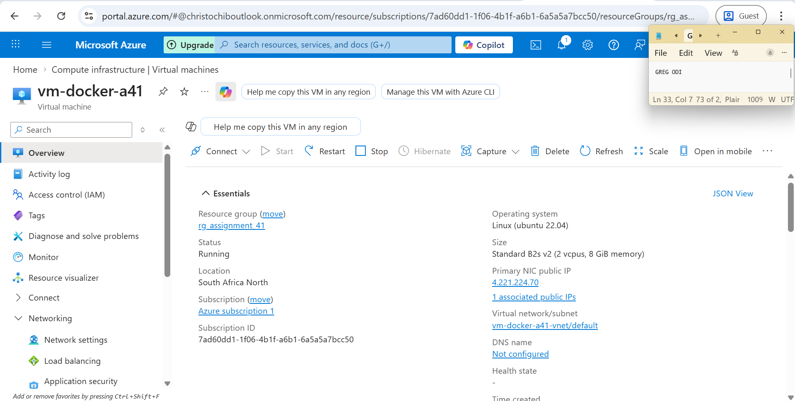
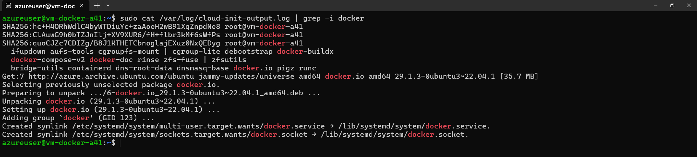
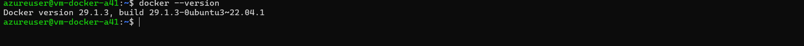
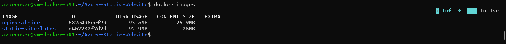
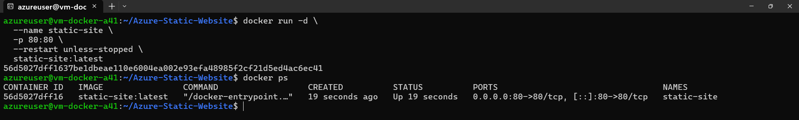
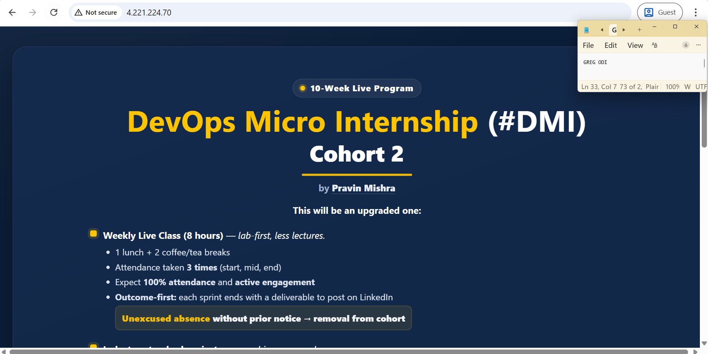
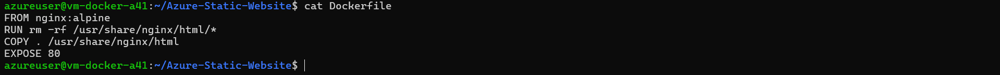

# Assignment 41: Cloud VM Bootstrap + Docker Deploy

## What Was Built
- 1 Azure Ubuntu 22.04 VM (South Africa North) bootstrapped with cloud-init
- Docker installed automatically via cloud-init (no manual install)
- Docker image for Azure-Static-Website served by Nginx
- Container running and publicly accessible on port 80

## Architecture
## Prerequisites
- Azure CLI installed and logged in (`az login`)
- SSH key pair at `~/.ssh/id_rsa` and `~/.ssh/id_rsa.pub`
- Python 3 with azure-mgmt-compute, azure-mgmt-network, azure-identity installed

## Project Structure
## Step-by-Step Deployment Guide

### Step 1 — Create Resource Group
```bash
az group create --name rg_assignment_41 --location southafricanorth
```

### Step 2 — Review Cloud-Init Script
The `cloud-init-docker.yml` file automatically:
- Updates and upgrades packages
- Installs docker.io
- Enables and starts Docker service
- Adds azureuser to the docker group

### Step 3 — Provision the VM
```bash
python3 create_vm.py
```
This uses the Azure REST API to create:
- Public IP (Standard SKU)
- VNet + Subnet
- NSG
- NIC
- Ubuntu 22.04 VM with cloud-init attached

### Step 4 — Open Ports
```bash
# Port 80 - HTTP public access
az network nsg rule create \
  --resource-group rg_assignment_41 \
  --nsg-name vm-docker-a41-nsg \
  --name allow-http \
  --protocol tcp \
  --priority 100 \
  --destination-port-range 80 \
  --access Allow

# Port 22 - SSH access
az network nsg rule create \
  --resource-group rg_assignment_41 \
  --nsg-name vm-docker-a41-nsg \
  --name allow-ssh \
  --protocol tcp \
  --priority 110 \
  --destination-port-range 22 \
  --access Allow
```

### Step 5 — SSH Into VM
```bash
ssh azureuser@<VM_PUBLIC_IP>
```

### Step 6 — Verify Docker (installed by cloud-init)
```bash
sudo cat /var/log/cloud-init-output.log | grep -i docker
docker --version
```

### Step 7 — Clone App & Create Dockerfile
```bash
git clone https://github.com/pravinmishraaws/Azure-Static-Website.git
cd Azure-Static-Website

cat > Dockerfile <<'DOCKERFILE'
FROM nginx:alpine
RUN rm -rf /usr/share/nginx/html/*
COPY . /usr/share/nginx/html
EXPOSE 80
DOCKERFILE
```

### Step 8 — Build Docker Image
```bash
docker build -t static-site:latest .
docker images
```

### Step 9 — Run Container
```bash
docker run -d \
  --name static-site \
  -p 80:80 \
  --restart unless-stopped \
  static-site:latest

docker ps
```

### Step 10 — Test in Browser
## Screenshots
| # | Screenshot | Description |
|---|-----------|-------------|
| SS1 |  | Azure Portal VM overview + NSG rules |
| SS2 |  | cloud-init-output.log showing Docker install |
| SS3 |  | docker --version on VM terminal |
| SS4 |  | docker images showing static-site:latest |
| SS5 |  | docker ps showing port mapping 0.0.0.0:80->80/tcp |
| SS6 |  | Browser showing live site |
| SS7 |  | Dockerfile content |

## Lessons Learned
- Azure CLI 2.85.0 has a JSON parsing bug with deprecation warnings — used Python REST API as workaround
- canadacentral vCPU quota was exhausted — switched to southafricanorth (6 vCPU quota)
- Standard_B2s not available in canadacentral — Standard_B2s_v2 works in southafricanorth
- Cloud-init runs in background after VM boot — wait 3-4 minutes before SSH

## Cleanup
```bash
az group delete --name rg_assignment_41 --yes --no-wait
```

## Author
Greg Odi | gregodprogrammer | DMI Cohort-2 | April 2026
