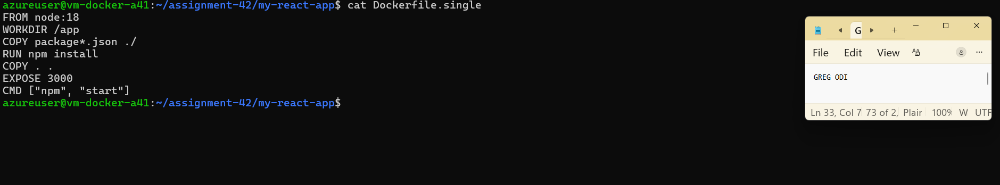
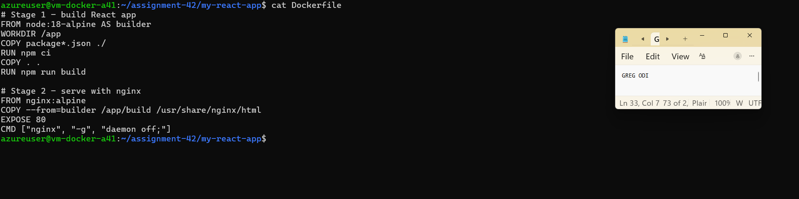
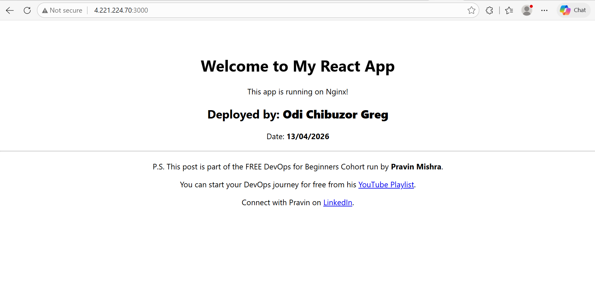
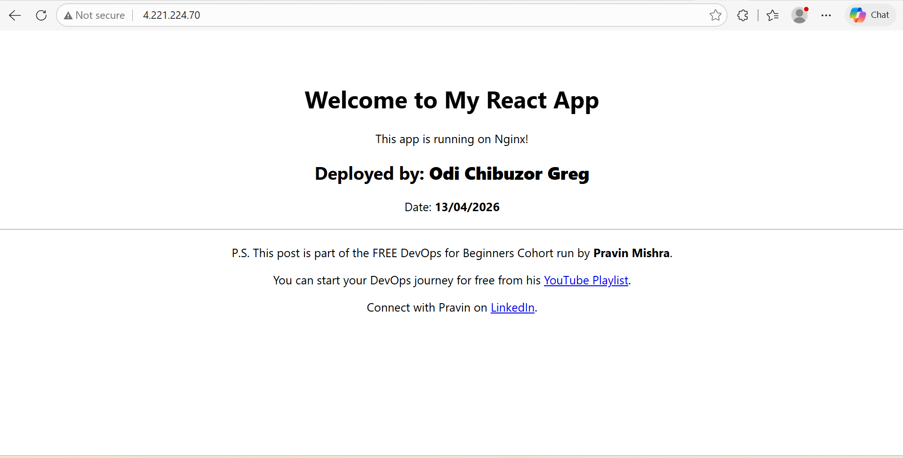
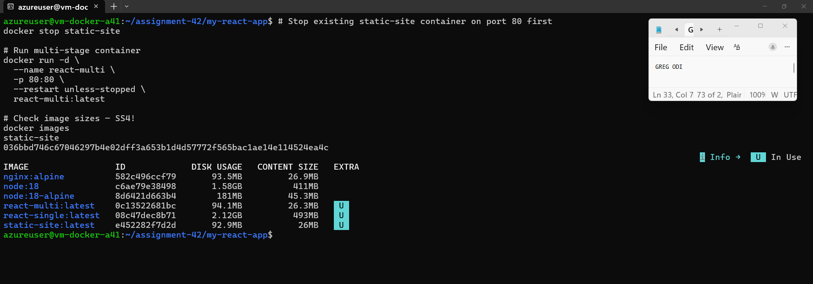
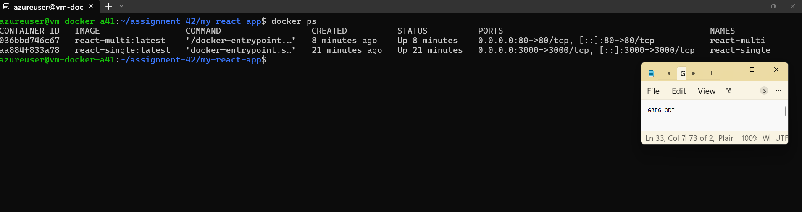

# Assignment 42: Multi-Stage Docker Build for a React App

## What Was Built
- Single-stage baseline image (react-single) using node:18
- Optimized multi-stage image (react-multi) using node:18-alpine + nginx:alpine
- Both containers running simultaneously on the same VM
- 95.6% image size reduction achieved

## Image Size Comparison
| Image | Size | Type |
|-------|------|------|
| react-single:latest | 2.12GB | Single-stage (node:18) |
| react-multi:latest | 94.1MB | Multi-stage (nginx:alpine) |
| **Reduction** | **95.6%** | |

## VM Used
- **Name:** vm-docker-a41 (reused from Assignment 41)
- **Public IP:** <VM_PUBLIC_IP>
- **Region:** South Africa North
- **Resource Group:** rg_assignment_41

## Two Deployment Approaches

### Approach A — Fresh VM (New Assignment)
```bash
# 1. Create resource group
az group create --name rg_assignment_42 --location southafricanorth

# 2. Create VM with Docker pre-installed via cloud-init
# (refer to assignment-41/cloud-init-docker.yml)

# 3. Open ports
az network nsg rule create --resource-group rg_assignment_42 \
  --nsg-name <nsg-name> --name allow-http --protocol tcp \
  --priority 100 --destination-port-range 80 --access Allow

az network nsg rule create --resource-group rg_assignment_42 \
  --nsg-name <nsg-name> --name allow-3000 --protocol tcp \
  --priority 120 --destination-port-range 3000 --access Allow

# 4. SSH into VM and follow Steps below
```

### Approach B — Reuse Existing VM (What We Did)
```bash
# VM already has Docker from Assignment 41
# Just open port 3000 for single-stage container
az network nsg rule create --resource-group rg_assignment_41 \
  --nsg-name vm-docker-a41-nsg --name allow-3000 --protocol tcp \
  --priority 120 --destination-port-range 3000 --access Allow

# SSH into existing VM
ssh azureuser@<VM_PUBLIC_IP>
```

## Step-by-Step Deployment

### Step 1 — Clone the React App
```bash
mkdir -p ~/assignment-42
cd ~/assignment-42
git clone https://github.com/pravinmishraaws/my-react-app.git
cd my-react-app
```

### Step 2 — Create .dockerignore
```bash
cat > .dockerignore <<'IGNORE'
node_modules
build
.git
.gitignore
*.md
.env
.env.*
npm-debug.log
IGNORE
```

### Step 3 — Create Dockerfile.single (Baseline)
```bash
cat > Dockerfile.single <<'SINGLE'
FROM node:18
WORKDIR /app
COPY package*.json ./
RUN npm install
COPY . .
EXPOSE 3000
CMD ["npm", "start"]
SINGLE
```

### Step 4 — Build & Run Single-Stage
```bash
docker build -f Dockerfile.single -t react-single:latest .
docker run -d --name react-single -p 3000:3000 \
  --restart unless-stopped react-single:latest
```
Visit: http://<VM_PUBLIC_IP>:3000

### Step 5 — Multi-Stage Dockerfile (already in repo)
### Step 6 — Build & Run Multi-Stage
```bash
docker build -t react-multi:latest .
docker stop static-site  # stop any container on port 80
docker run -d --name react-multi -p 80:80 \
  --restart unless-stopped react-multi:latest
```
Visit: http://<VM_PUBLIC_IP>

### Step 7 — Compare Image Sizes
```bash
docker images
```

## Screenshots
| # | Screenshot | Description |
|---|-----------|-------------|
| SS1 |  | Dockerfile.single content |
| SS2 |  | Dockerfile multi-stage content |
| SS3a |  | Single-stage app at port 3000 |
| SS3b |  | Multi-stage app at port 80 |
| SS4 |  | docker images — size comparison |
| SS5 |  | docker ps — both containers running |

## Analysis
The single-stage image (2.12GB) includes Node.js runtime, npm, all dev dependencies,
build tools, and the React source — everything needed to BUILD the app stays in the image.
The multi-stage image (94.1MB) contains ONLY the compiled static files and Nginx —
a 95.6% reduction. This matters because: smaller images have fewer packages to exploit
(reduced attack surface), push/pull faster in CI/CD pipelines, and boot faster in production.
The caching optimization (COPY package*.json first, then RUN npm install, then COPY source)
means dependency layers are cached and only rebuild when package.json changes.

## Lessons Learned
1. Multi-stage builds separate build environment from runtime — only ship what you need
2. node:18 = 1.58GB base image vs node:18-alpine = 181MB — always use alpine in production
3. Layer caching: copy dependency files first, source code last — saves minutes on rebuilds
4. Same app output, 95.6% smaller image — this is what production Docker looks like
5. Reusing existing VM saves provisioning time for related assignments

## Cleanup
```bash
docker stop react-single react-multi
docker rm react-single react-multi
az group delete --name rg_assignment_41 --yes --no-wait
```

## Author
Greg Odi | gregodprogrammer | DMI Cohort-2 | April 2026
